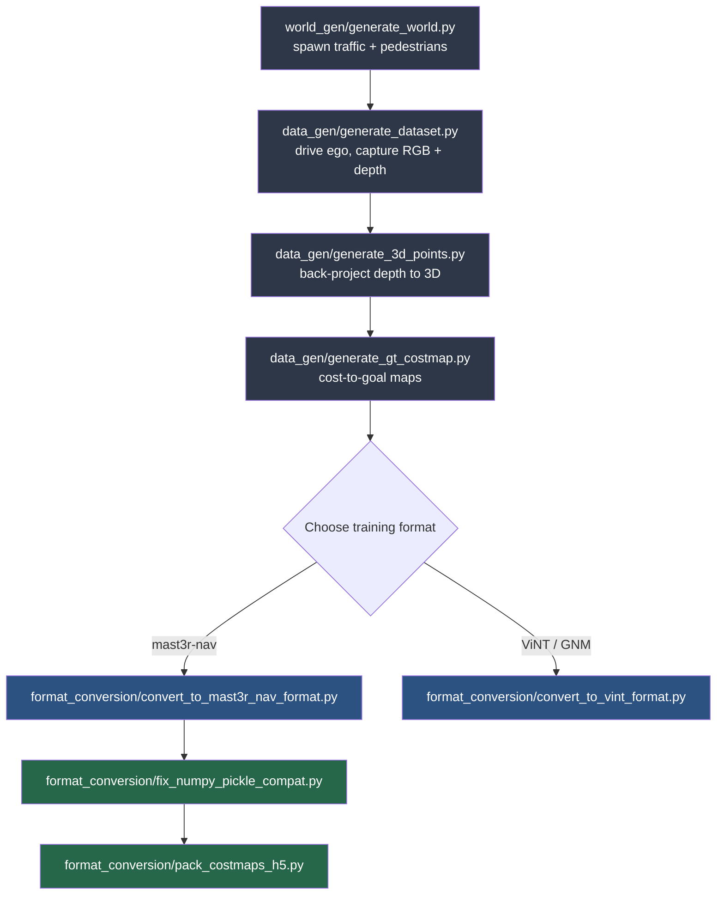

# CARLA Dataset Generator for GNM / ViNT / mast3r-nav

Generate CARLA driving datasets — RGB, metric depth, 3D point clouds, and
ground-truth cost-to-goal maps — and convert them straight into training
formats for **GNM**, **ViNT**, and **mast3r-nav**.

> [!IMPORTANT]
> Built and tested against **CARLA (Unreal Engine 5) v0.10.0**. A CARLA server
> must be running for the world-generation and driving stages.

---

## Contents

- [How it fits together](#how-it-fits-together)
- [Requirements](#requirements)
- [Quick start](#quick-start)
- [Output layout](#output-layout)
- [mast3r-nav conversion output structure](#mast3r-nav-conversion-output-structure)
- [Known gotchas](#known-gotchas)
- [Settings used in this repo's reference run](#settings-used-in-this-repos-reference-run)
- [Full reference](usage_details/more_info.md)
- [Training a controller on this data](usage_details/training.md)

---

## How it fits together



Two orchestrators drive most of this for you:

| Orchestrator | Runs | Requires CARLA running? |
|---|---|---|
| `generate_mass_dataset.py` | World generation → drive & capture → 3D points → costmaps, for every world/trajectory combo | Yes, at least through capture (see [Known gotchas](#known-gotchas)) |
| `postprocess.py` | mast3r-nav format conversion → pickle compatibility fix → HDF5 costmap packing | No |

`eval_open_loop.py` is a separate tool for evaluating a trained mast3r-nav
controller against recorded trajectories — see the [full reference](more_info.md#eval_open_looppy)
and [`TRAINING.md`](TRAINING.md) for details.

---

## Requirements

- **CARLA 0.10.0** (Unreal Engine 5 build), Python API on your `PYTHONPATH`
- Python 3.10+ (uses `list[str]` / `dict[str, str]` type hints)
- `numpy`, `opencv-python`, `h5py`
- `matplotlib`, `natsort` (only needed for `eval_open_loop.py`)
- A trained/checkpointed mast3r-nav controller (only for `eval_open_loop.py`)

```bash
pip install numpy opencv-python h5py matplotlib natsort
```

There is no `requirements.txt` or CARLA wheel bundled here — install the CARLA
0.10.0 Python API separately and make sure `import carla` works before running
anything below.

---

## Quick start

**0. Before your first run**, fix the hardcoded CARLA path in
`data_gen/generate_dataset.py` and `data_gen/generate_gt_costmap.py`. Both
files have a `sys.path.insert()` statement pointing to a CARLA installation.
Replace that path with the path to **your own** CARLA install's
`PythonAPI/carla` directory — specifically, the directory that contains the
`agents/navigation/` package, since that's where `GlobalRoutePlanner` (the
global route planner agent used to build routes and geodesic costs) lives.
If `carla` and `agents` are already importable in your environment, you can
delete the line entirely.

**1. Start CARLA**, then generate a full dataset across multiple worlds:

```bash
python generate_mass_dataset.py \
    --host 127.0.0.1 --port 2000 \
    --out out \
    --num_worlds 3 --trajectories_per_world 10 \
    --world_seed_base 42 --traj_seed_base 42 \
    --cost groundplane
```

We recommend `--world_seed_base 42 --traj_seed_base 42` — that's what was
used to produce the reference run described further down in this README.

This produces `out/world00_traj00 … out/world02_traj09`, each with RGB
frames, depth, 3D points, and cost-to-goal maps already computed.

> Some trajectories may end up incomplete or missing costmaps entirely — a
> collision, a sensor timeout, or a CARLA hiccup partway through a scene can
> cause a given world/trajectory to fail one of the four stages. You don't
> need to clean these up by hand: `postprocess.py` (next step) skips any
> scene it can't fully convert and keeps going.

**2. Convert to a training format** (CARLA no longer needs to be running):

```bash
python postprocess.py \
    --scenes_glob "out/*" \
    --dataset_root converted/my_dataset \
    --dataset_name my_dataset \
    --graphs_path converted \
    --cost groundplane
```

This runs the mast3r-nav conversion, patches NumPy 2.x pickles for NumPy 1.x
compatibility, and packs costmaps into a single HDF5 file — all in one call.
Scenes with missing/incomplete data (see the note above) are skipped with a
warning rather than failing the whole run. With `--graphs_path` set to the
parent of `--dataset_root` like above, everything ends up side by side under
`converted/` — see [mast3r-nav conversion output structure](#mast3r-nav-conversion-output-structure)
below for exactly what that looks like.

The same conversion scripts also work on a **custom dataset** that isn't
produced by `generate_mass_dataset.py` at all — mast3r-nav or ViNT/GNM
training format, your own or someone else's — as long as each scene
directory follows the [output layout](#output-layout) below.

Want ViNT/GNM format instead? Run the alternate converter directly (it isn't
wired into `postprocess.py`):

```bash
python format_conversion/convert_to_vint_format.py \
    --scenes_glob "out/*" \
    --dataset_root converted/vint_dataset \
    --cost groundplane
```

See [`more_info.md`](more_info.md) for every flag, manual step-by-step
execution, and per-script details. See [`TRAINING.md`](TRAINING.md) for how
to actually train a controller on the converted dataset.

---

## Output layout

Each collected scene lands in `out/<scene_name>/`:

```
out/world00_traj00/
├── images/                 000000.png …            RGB, 320×240
├── images_depth/           000000.npy …             metric depth (m), float32
├── 3d_points/              000000.npy …              (H, W, 3) camera-frame points
├── costmaps/               000000.png …              grayscale cost visualization
├── costmaps_color/         000000.png …              (optional, --color) RGB visualization
├── costmaps_raw/           000000.npy …               raw float32 metric costs
├── trajectory.npy          (K, 3)   anchor waypoints, world XYZ
├── agent_states.npy        (N, 6)   x y z roll pitch yaw per frame
├── camera_intrinsics.npy   (3, 3)
└── camera_extrinsics.npy   (N, 4, 4) camera-to-world per frame
```

---

## mast3r-nav conversion output structure

`postprocess.py` writes to two places: `--dataset_root` (the converted
dataset itself) and `--graphs_path` (a packed, downsampled costmap file for
training). Pointing `--graphs_path` at the parent of `--dataset_root` — as in
the [Quick start](#quick-start) command above — lands everything together
under one folder:

```
converted_dataset/
├── <dataset_name>_costmaps.h5             packed, downsampled costmaps (target_h × target_w)
└── <dataset_name>/
    ├── compiled_costmaps.h5            full-resolution costmaps, all trajectories concatenated
    ├── world00_traj00 (traj_name)/
    │   ├── images/                     0.jpg … T.jpg, renumbered RGB frames
    │   ├── traj_data.pkl               {"position": (T, 2) xy, "yaw": (T, 1)}, egocentric to frame 0
    │   ├── traj_data.pkl.bak           pre-fix backup (skip with --no_backup)
    │   └── costmap_world00_traj00.npz  (T, H, W) raw metric costs for this trajectory
    ├── world00_traj01/
    │   └── ...                         same layout as world00_traj00/
    └── ...                             one folder per successfully converted scene
```

Costmaps are always the raw metric floats pulled from `costmaps_raw/`, never
the `costmaps/*.png` visualizations. Position/yaw in `traj_data.pkl` are
first converted from CARLA to ROS convention, then made egocentric to the
trajectory's own start pose (`position[0] ≈ (0, 0)`, `yaw[0] ≈ 0`). See
[`more_info.md`](more_info.md#format_conversionconvert_to_mast3r_nav_formatpy)
for the full details.

---

## Known gotchas

- **Hardcoded CARLA path.** `data_gen/generate_dataset.py` and
  `data_gen/generate_gt_costmap.py` both insert a personal CARLA install path
  onto `sys.path` — see step 0 in [Quick start](#quick-start) for the fix.
- **`generate_navmesh.py` was built during early ideation and isn't wired
  into the pipeline.** It connects to `localhost:2000` (not configurable via
  flags) and writes a filtered grid of drivable-surface points to
  `navmesh.npy` in the current directory. Nothing else in this repo
  currently reads that file, but it's a reasonable starting point if you
  want to build an alternative ego-travel method (e.g. sampling routes
  directly from the navmesh instead of the road-graph random walk that
  `generate_dataset.py` uses).
- **`postprocess.py` always packs the HDF5 costmap file** — `--dataset_name`
  is a required argument, so step 3 (`pack_costmaps_h5.py`) isn't actually
  optional when going through the orchestrator, unlike calling the format
  conversion scripts individually.
- **The `--cost` flag on `postprocess.py` / `convert_to_mast3r_nav_format.py`
  is a bookkeeping label only.** It doesn't select between multiple
  precomputed cost types — `costmaps_raw/` always holds whichever `--cost`
  was actually used when `generate_gt_costmap.py` ran for that scene. You
  can omit `--cost` entirely when post-processing without changing the
  result.
- **Controller config YAMLs need to move and be edited.** The files under
  `configs/` in this repo (`carla_waypixel.yaml`, `carla_learnt.yaml`) are
  mast3r-nav controller configs. They belong inside
  `configs/controller/` of the [mast3r-nav](https://github.com/vanshg1729/mast3r-nav)
  repo, and still contain the original author's machine paths
  (`load_run`, `graphs_path`) — update these to your own paths before use.
  See [`TRAINING.md`](TRAINING.md) for the full setup.
- **`geodesic` costs need CARLA running.** `euclidean3d` and `groundplane`
  don't — the CARLA server can be closed right after
  `data_gen/generate_dataset.py` finishes for those.

---

## Settings used in this repo's reference run

For reproducibility, the dataset referenced throughout this README and
`TRAINING.md` was generated with:

```bash
python generate_mass_dataset.py \
    --host 127.0.0.1 --port 2000 \
    --out out \
    --num_worlds 1 --trajectories_per_world 10 \
    --world_seed_base 42 --traj_seed_base 42 \
    --cost geodesic --lateral_penalty --lateral_penalty_weight 1.0
```

and converted with:

```bash
python postprocess.py \
    --scenes_glob "out/*" \
    --dataset_root converted/my_dataset \
    --dataset_name my_dataset \
    --graphs_path converted
```

(`--cost` is intentionally omitted from the `postprocess.py` call — as noted
above, it's a leftover bookkeeping label and doesn't affect the conversion.)

## Citation:
```
@inproceedings{Dosovitskiy17,
  title     = {CARLA: An Open Urban Driving Simulator},
  author    = {Dosovitskiy, Alexey and Ros, German and Codevilla, Felipe and Lopez, Antonio and Koltun, Vladlen},
  booktitle = {Conference on Robot Learning},
  pages     = {1--16},
  year      = {2017}
}

@misc{garg2026mast3rnavwaypixelnavigationrelative,
      title={MASt3R-Nav: WayPixel Navigation in Relative 3D Maps},
      author={Vansh Garg and Rohit Jayanti and Krish Pandya and Sarthak Chittawar and Siddharth Tourani and Muhammad Haris Khan and Sourav Garg and Madhava Krishna},
      year={2026},
      eprint={2605.24111},
      archivePrefix={arXiv},
      primaryClass={cs.RO},
      url={https://arxiv.org/abs/2605.24111},
}

@inproceedings{shah2022gnm,
  author    = {Dhruv Shah and Ajay Sridhar and Arjun Bhorkar and Noriaki Hirose and Sergey Levine},
  title     = {{GNM: A General Navigation Model to Drive Any Robot}},
  booktitle = {International Conference on Robotics and Automation (ICRA)},
  year      = {2023},
  url       = {https://arxiv.org/abs/2210.03370}
}

@inproceedings{shah2023vint,
  title     = {Vi{NT}: A Foundation Model for Visual Navigation},
  author    = {Dhruv Shah and Ajay Sridhar and Nitish Dashora and Kyle Stachowicz and Kevin Black and Noriaki Hirose and Sergey Levine},
  booktitle = {7th Annual Conference on Robot Learning},
  year      = {2023},
  url       = {https://arxiv.org/abs/2306.14846}
}

@article{sridhar2023nomad,
  author  = {Ajay Sridhar and Dhruv Shah and Catherine Glossop and Sergey Levine},
  title   = {{NoMaD: Goal Masked Diffusion Policies for Navigation and Exploration}},
  journal = {arXiv pre-print},
  year    = {2023},
  url     = {https://arxiv.org/abs/2310.xxxx}
}
```
